# 🧠 Data Science Project阿

  
  
  
  

# 🏠 House Price Prediction

### 📊 Visualization

  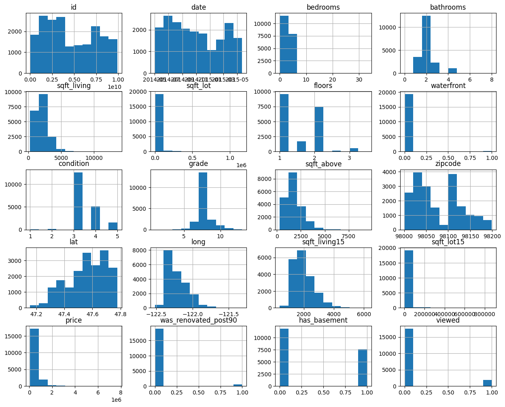
  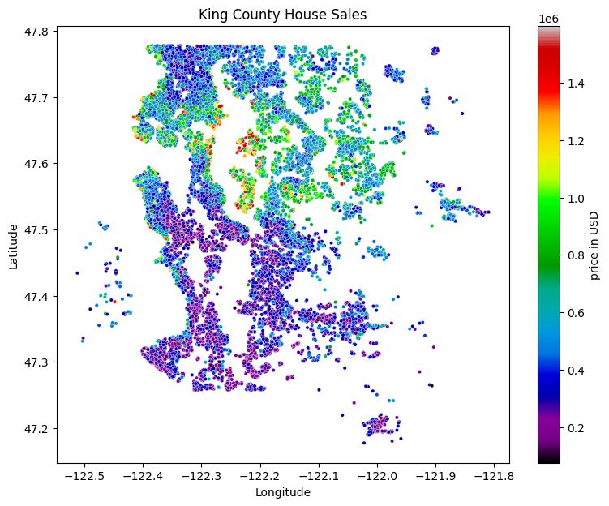

### 📈 Regression Analysis

  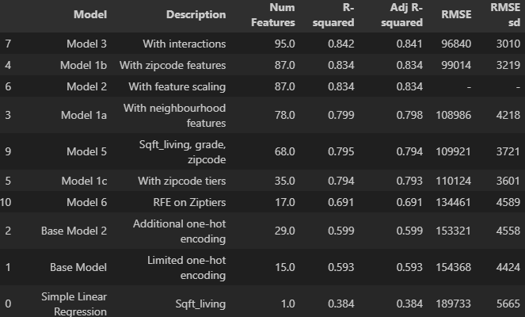

  <i>Built predictive models to analyze key factors influencing housing prices.</i>

  

# 🔥 Fire Spread Simulation

### 🚒 Simulation Overview

  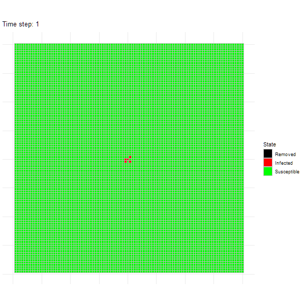

### 📊 Exploratory Analysis

  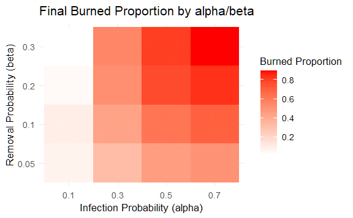
  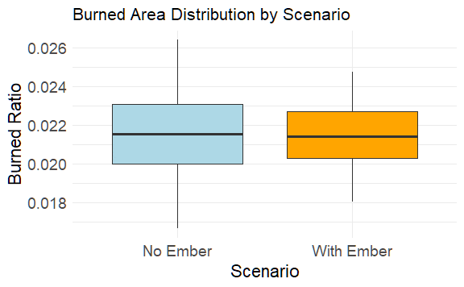
  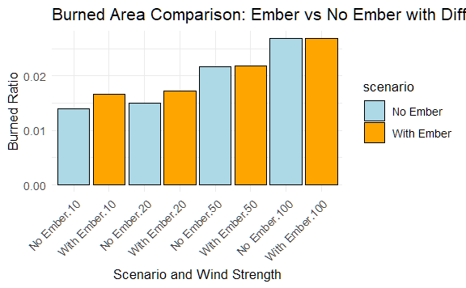

  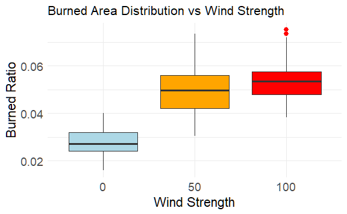
  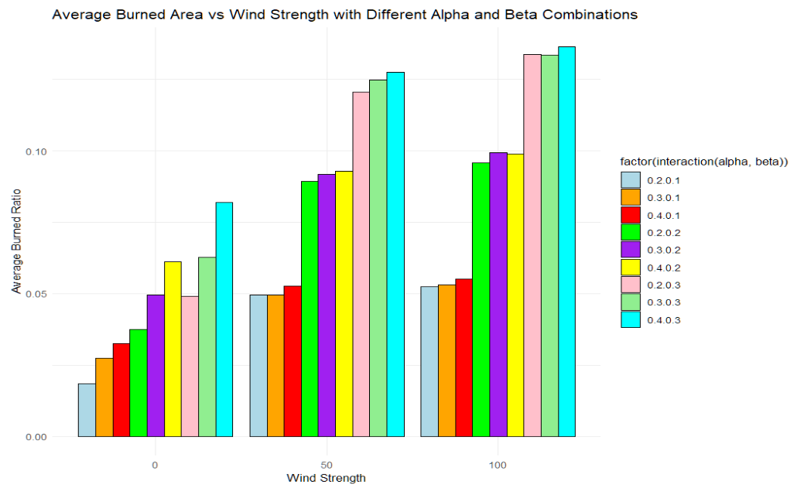
  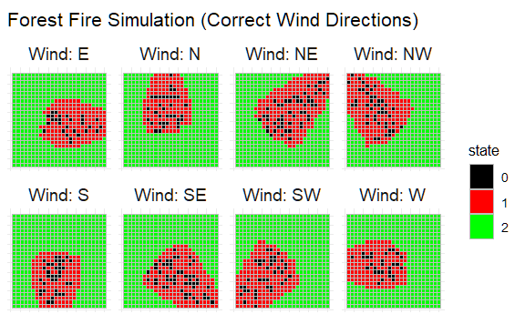

  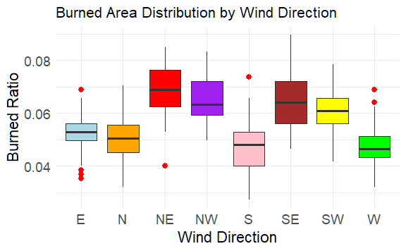
  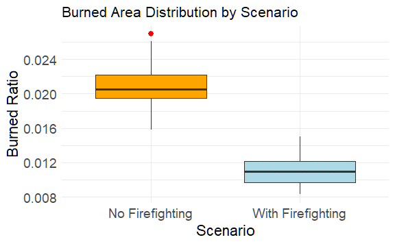

### 📈 Regression Analysis

  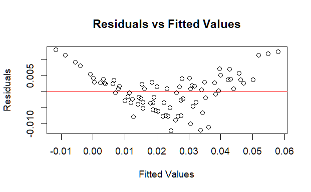
  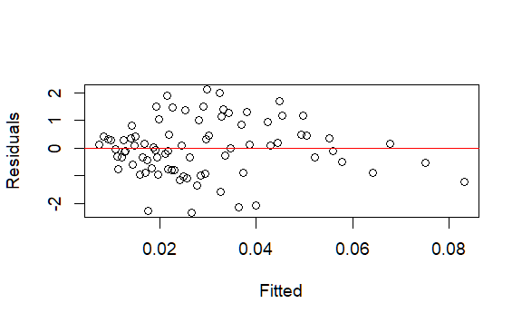

  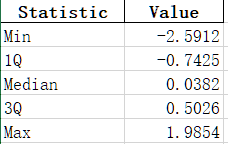

  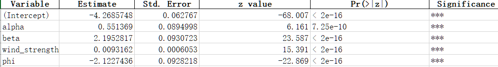

